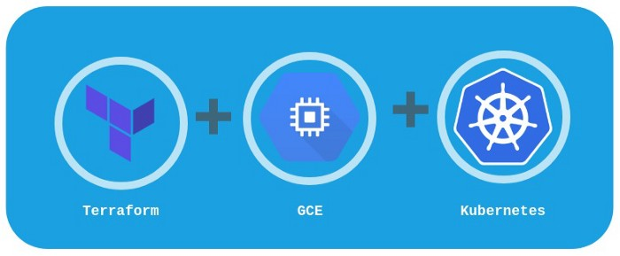

**Kubernetes on GCE**



The below steps will install _Kubernetes on Ubuntu_

**_Installing Master_**

- Configure _variables.tf_ and run `terraform plan` and `terraform apply` (make sure you have sufficient permissions, if needed run `gcloud auth login`)
- Once the infrastructure is ready, *SSH* into the server and run the script under _configs/files/k8s_install.sh_
- Initialize Kubernetes on Master Node `kubeadm init --pod-network-cidr=10.244.0.0/16`
- Post initialization of the kubernetes master, run the below commands
```
mkdir -p $HOME/.kube
sudo cp -i /etc/kubernetes/admin.conf $HOME/.kube/config
sudo chown $(id -u):$(id -g) $HOME/.kube/config
```
- Copy the kubeadm join command to add workers
```
kubeadm join 10.128.0.17:6443 --token <id>  \
--discovery-token-ca-cert-hash <hash>
```

**_Installing Worker_**

- Configure _variables.tf_ and run `terraform plan` and `terraform apply` (make sure you have sufficient permissions, if needed run `gcloud auth login`)
- Once the infrastructure is ready, *SSH* into the server and run the script under _configs/files/k8s_install.sh_

**_Initializing Master_**


- Run `kubectl get nodes` to check the number of nodes


The node isn’t Ready as it doesn’t have any overlay virtual network configured like flannel or calico

`kubectl apply -f https://docs.projectcalico.org/v3.14/manifests/calico.yaml` [CALICO]

OR

`kubectl apply -f https://raw.githubusercontent.com/coreos/flannel/master/Documentation/kube-flannel.yml` [FLANNEL]
